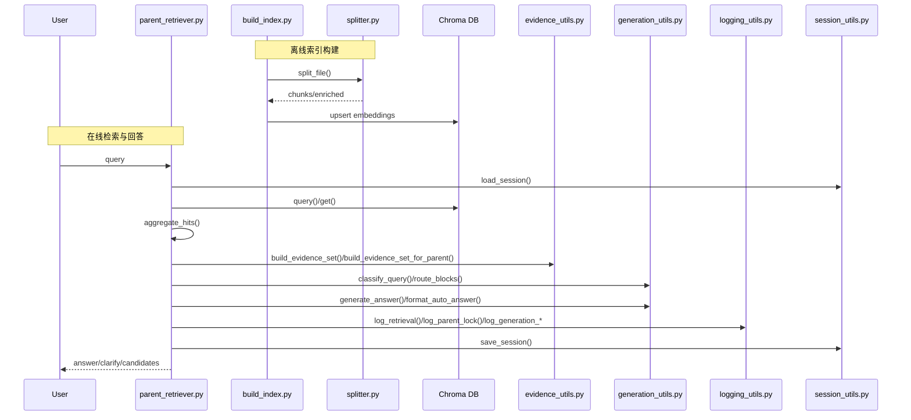

# 项目整体框架（src 范围）

## 模块分层
- 数据处理层：`src/data_process/`
  - 将原始菜谱 Markdown 转为结构化 chunk 并写入向量库。
- 检索与会话层：`src/retrieval/`
  - 向量检索 + 父级聚合
  - 锁定/歧义处理
  - 证据构建与规则化回答
  - 日志与会话持久化

## 数据流
1) `splitter.py`：解析 Markdown → 结构化 chunk + enriched 文本。
2) `build_index.py`：遍历数据 → embedding → Chroma collection。
3) `parent_retriever.py`：查询 collection → 父级聚合 → 锁定/歧义 → 证据集。
4) `evidence_utils.py` / `generation_utils.py`：证据筛选与回答生成。
5) `logging_utils.py` / `session_utils.py`：运行日志与会话锁定存储。

## 文件间关系（依赖方向）
- `src/data_process/build_index.py` → `src/data_process/splitter.py`
- `src/retrieval/parent_retriever.py` →
  - `src/retrieval/model_utils.py`
  - `src/retrieval/evidence_utils.py`
  - `src/retrieval/generation_utils.py`
  - `src/retrieval/logging_utils.py`
  - `src/retrieval/session_utils.py`
  - `src/retrieval/retrieval_types.py`
- `src/retrieval/evidence_utils.py` →
  - `src/retrieval/model_utils.py`
  - `src/retrieval/generation_utils.py`
  - `src/retrieval/retrieval_types.py`
- `src/retrieval/logging_utils.py` → `src/retrieval/retrieval_types.py`
- `src/retrieval/session_utils.py` → `src/retrieval/retrieval_types.py`

## 模块调用顺序图（主流程）

## 各文件说明索引
- `docs/src_data_process_splitter.md`
- `docs/src_data_process_build_index.md`
- `docs/src_retrieval_model_utils.md`
- `docs/src_retrieval_retrieval_types.md`
- `docs/src_retrieval_evidence_utils.md`
- `docs/src_retrieval_generation_utils.md`
- `docs/src_retrieval_logging_utils.md`
- `docs/src_retrieval_session_utils.md`
- `docs/src_retrieval_parent_retriever.md`
